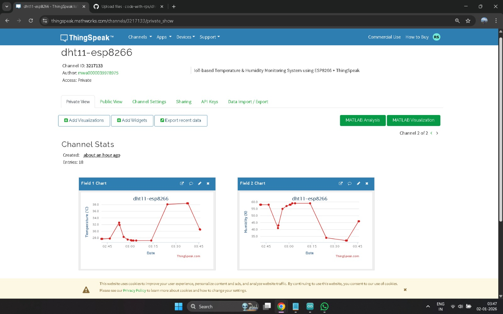

# DHT11 ESP8266 ThingSpeak Monitoring System

An IoT-based temperature and humidity monitoring system using ESP8266 NodeMCU and DHT11 sensor.  
The system collects real-time environmental data and uploads it to the ThingSpeak cloud platform for remote monitoring and visualization.

---

## 📁 Project Structure

```text
dht11-esp8266-thingspeak/
├── code/
│   └── dht11_esp8266_thingspeak.ino
├── images/
│   └── thingspeak_output.png
├── README.md
└── LICENSE
```

---

## ✨ Features

- Real-time temperature monitoring
- Real-time humidity monitoring
- Wi-Fi based IoT communication
- Cloud data visualization using ThingSpeak
- Simple and low-cost implementation
- Serial monitor debugging support

---

## 🛠 Components Used

| Component | Quantity |
|------------|------------|
| ESP8266 NodeMCU | 1 |
| DHT11 Sensor | 1 |
| Breadboard | 1 |
| Jumper Wires | Several |
| USB Cable | 1 |

---

## 🔌 Circuit Connections

| DHT11 Pin | ESP8266 Pin |
|------------|-------------|
| VCC | 3.3V |
| GND | GND |
| DATA | D4 |

---

## 🔧 Setup Instructions

### 1. Clone the Repository

```bash
git clone https://github.com/code-with-rps/dht11-esp8266-thingspeak.git
```

---

### 2. Open the Arduino File

```text
code/dht11_esp8266_thingspeak.ino
```

---

### 3. Install Required Libraries

Install the following libraries from the Arduino Library Manager:

- ESP8266WiFi
- Adafruit DHT Sensor Library
- Adafruit Unified Sensor

---

### 4. Update Wi-Fi and API Credentials

Replace the placeholders in the code:

```cpp
const char* ssid = "YOUR_WIFI_NAME";
const char* password = "YOUR_WIFI_PASSWORD";
String apiKey = "YOUR_THINGSPEAK_API_KEY";
```

---

### 5. Select Board and Port

- **Board:** NodeMCU 1.0 (ESP-12E Module)
- **Port:** COMxx

---

### 6. Upload the Code

Upload the program to the ESP8266 board using Arduino IDE.

---

## ▶️ How It Works

1. The DHT11 sensor measures temperature and humidity.
2. ESP8266 connects to a 2.4 GHz Wi-Fi network.
3. Sensor data is sent to ThingSpeak using HTTP requests.
4. ThingSpeak displays the data as live graphs and charts.
5. Users can remotely monitor environmental conditions.

---

## 📊 Output

Below is the ThingSpeak cloud output:



---

## 🧠 Learning Outcomes

- Sensor interfacing with ESP8266
- Wi-Fi networking and HTTP communication
- Cloud-based IoT data visualization
- Serial communication and debugging
- Understanding end-to-end IoT architecture

---

## 🔐 Security Note

Wi-Fi credentials and ThingSpeak API keys are not included in this repository.  
Users must add their own credentials before uploading the code.

---

## 📌 Future Improvements

- OLED display integration
- Email or alert notifications
- Relay-based automation
- Mobile app dashboard
- CSV export and analytics
- Support for multiple sensors

---

## 👤 Author

**Rudrapratap Singh**

GitHub: https://github.com/code-with-rps

---

## 📜 License

This project is licensed under the MIT License.
